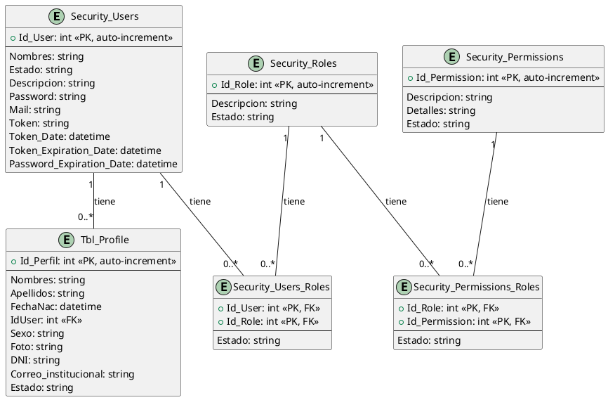

# Lógica del Modelo de Entidades de Seguridad

Este documento describe el modelo de entidades de seguridad de la aplicación, explicando el propósito de cada tabla y los aspectos de seguridad que cubren. También se incluye un diagrama para una mejor comprensión visual de las relaciones.

## Diagrama de Entidades de Seguridad

## Explicación de las Entidades y Aspectos de Seguridad

### 1. `Security_Users`

*   **Propósito**: Representa a los usuarios registrados en el sistema. Almacena sus credenciales y otra información relevante para la autenticación y gestión de cuentas.
*   **Aspectos de Seguridad que Cubre**:
    *   **Autenticación**: `Password` es fundamental para verificar la identidad del usuario. Los campos `Token`, `Token_Date`, y `Token_Expiration_Date` son utilizados para la gestión de sesiones y la autenticación basada en tokens, asegurando que las sesiones tengan una duración limitada y puedan ser invalidadas.
    *   **Gestión de Usuarios**: El campo `Estado` permite habilitar o deshabilitar cuentas de usuario, controlando el acceso al sistema.
    *   **Política de Contraseñas**: `Password_Expiration_Date` puede ser utilizado para implementar políticas de caducidad de contraseñas, forzando a los usuarios a cambiar sus contraseñas periódicamente para aumentar la seguridad.
    *   **Auditoría**: Las fechas de creación y expiración de tokens (`Token_Date`, `Token_Expiration_Date`) pueden servir para auditar la actividad de las sesiones.

### 2. `Security_Roles`

*   **Propósito**: Define los diferentes roles o perfiles de acceso que un usuario puede tener en el sistema (e.g., Administrador, Editor, Lector). Los roles agrupan un conjunto de permisos para simplificar la administración de autorizaciones.
*   **Aspectos de Seguridad que Cubre**:
    *   **Autorización Basada en Roles (RBAC)**: Es la piedra angular del modelo RBAC, permitiendo asignar permisos de manera eficiente a grupos de usuarios a través de un rol, en lugar de asignar permisos individualmente a cada usuario.
    *   **Gestión de Roles**: Permite la creación, modificación y eliminación de roles, adaptando los niveles de acceso a las necesidades del negocio.

### 3. `Security_Permissions`

*   **Propósito**: Define las acciones atómicas o funcionalidades específicas que un usuario puede realizar en el sistema (e.g., `crear_documento`, `editar_perfil`, `ver_reportes`). Son las unidades más granulares de autorización.
*   **Aspectos de Seguridad que Cubre**:
    *   **Autorización Granular**: Permite un control muy preciso sobre qué operaciones puede realizar un usuario, basándose en los permisos que le han sido asignados (directa o indirectamente a través de roles).
    *   **Control de Acceso**: La `Descripción` y `Detalles` del permiso son vitales para entender y hacer cumplir las reglas de acceso en el código de la aplicación.

### 4. `Security_Users_Roles`

*   **Propósito**: Actúa como una tabla de unión para establecer la relación muchos a muchos entre `Security_Users` y `Security_Roles`. Indica qué roles tiene asignado cada usuario.
*   **Aspectos de Seguridad que Cubre**:
    *   **Asignación de Roles/Autorización**: Es crucial para determinar los derechos de acceso de un usuario. Al verificar los roles de un usuario, el sistema puede decidir qué funcionalidades o recursos son accesibles para él.
    *   **Gestión de Membresías**: Permite añadir o remover usuarios de roles específicos, modificando sus permisos de forma dinámica.

### 5. `Security_Permissions_Roles`

*   **Propósito**: Es una tabla de unión que establece la relación muchos a muchos entre `Security_Roles` y `Security_Permissions`. Define qué permisos están asociados a cada rol.
*   **Aspectos de Seguridad que Cubre**:
    *   **Configuración de Permisos de Roles**: Permite definir con precisión el conjunto de permisos que cada rol confiere. Esto centraliza la gestión de autorizaciones para grupos de usuarios.
    *   **Autorización Eficiente**: Al asignar permisos a roles, se simplifica la gestión de la seguridad, ya que cualquier cambio en los permisos de un rol afecta automáticamente a todos los usuarios asignados a ese rol.

### 6. `Tbl_Profile`

*   **Propósito**: Almacena información adicional y no crítica para la autenticación de los usuarios, como nombres, apellidos, fecha de nacimiento, DNI, sexo, foto y correo institucional. Está vinculada a `Security_Users` mediante `IdUser`.
*   **Aspectos de Seguridad que Cubre**:
    *   **Protección de Datos Personales**: Contiene datos sensibles (`DNI`, `FechaNac`, `Correo_institucional`). Es fundamental aplicar medidas de protección de datos, como el cifrado y controles de acceso estrictos, para cumplir con las normativas de privacidad.
    *   **Segregación de Información**: Separa la información personal del usuario de sus credenciales de autenticación, lo que puede ser una buena práctica de seguridad para limitar el impacto en caso de una brecha de datos.
    *   **Control de Acceso al Perfil**: La visualización y edición de esta información debe estar controlada por permisos específicos, asegurando que solo usuarios autorizados puedan acceder o modificar los perfiles. 